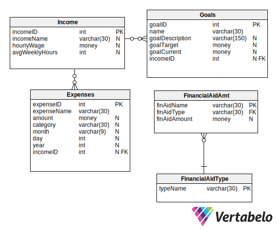

# Finance Central 
A starting point for the creation of a financial management application targeting college students. 

## Features
Finance Central allows its users to...
- Keep track of their income sources
- Categorize their expenses
- View their financial aid
- Create saving goals
- View a visual representation of the percentage of money spent each month.   <strong>Data visualization example: </strong>

## Database Design

### Using Finance Central
<ol>
  <li>Using SQL Server, create a database called FinanceCentral.</li>
  <li><a href="finance-central-ddl.sql">Click here for the script that creates the tables.</a></li>
  <li><a href="finance-central-insertion-file.sql">Click here for the script that populates the database with example data.</a></li>
  <li>Open the project in Visual Studio and run the local debugger.</li>
</ol>
